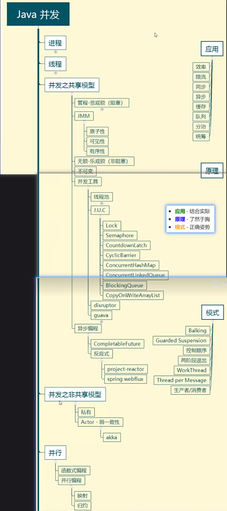
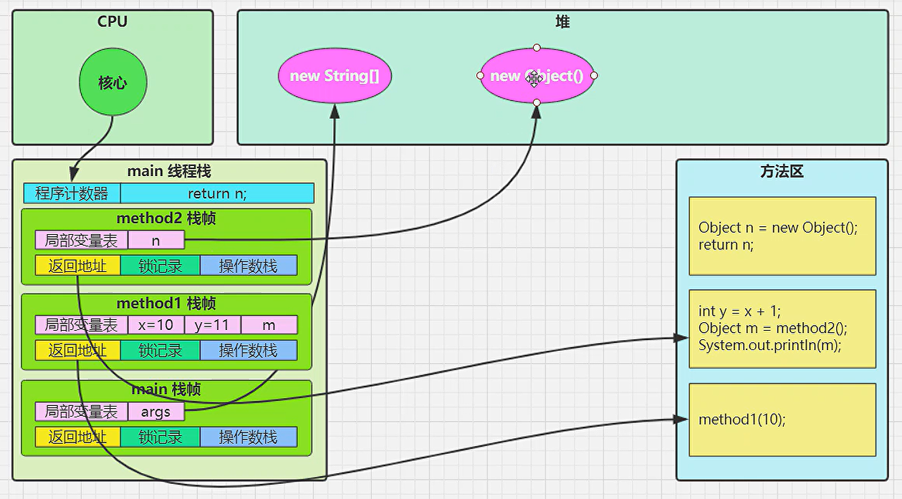
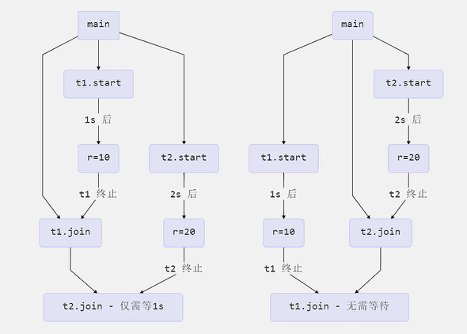
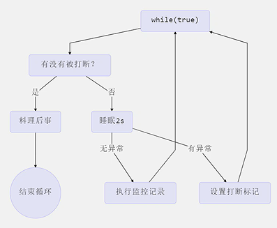
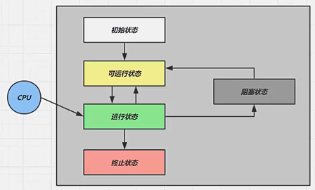
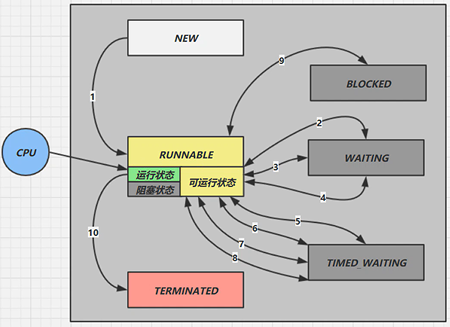

# Java并发编程

## 1. 概览



### 1.1. 关键笔记

🥑[Java创建线程的方式](#314-java创建线程的方式)

🥑[线程start和run的区别](#361-线程start和run的区别)

🥑[Java中有哪些锁]()

🥑[对synchronized的理解]()

🥑[synchronized和Lock的区别是什么]()

🥑[synchronized和ReentrantLock的区别是什么]()

🥑[volatile关键字的作用有那些？]()

🥑[volatile与synchronized的对比]()

## 2. 进程 & 线程

> 进程 & 线程的概念
> 
> 并行 & 并发的概念
> 
> 线程基本应用

### 2.1. 进程 & 线程

进程（Process）：操作系统资源分配的基本单位，可以理解为一个正在被执行的程序的实例

- 进程是用来在执行程序的时候加载指令，管理数据，管理IO的
- 线程（Thread）：操作系统最小的调度单位，是进程内的执行单元
- 一个线程就是一个指令流，将指令流中的指令以一定的顺序交给CPU去执行

二者对比：

特性 | 进程 | 线程
---------|----------|---------
资源分配 | 独立的内存、文件、CPU 时间等|共享进程的资源（内存、文件等）
独立性|高度隔离，崩溃不影响其他进程|共享内存，线程崩溃可能导致整个进程崩溃
通信方式 |需要进程间通信（IPC），如管道、消息队列等|直接读写共享内存（需加锁同步）
创建/销毁开销|高（需要分配独立资源）|低（复用进程资源）
切换开销|高（需切换内存空间、寄存器等）|低（仅切换寄存器、栈等）
应用场景|需要隔离的独立任务（如浏览器多标签页）|需要高效协作的任务（如并发计算、实时响应）

### 2.2. 并行 & 并发

并发（Concurrent）：线程轮流使用CPU的做法（当CPU是单核时，操作系统中的任务调度器组件会串行的将CPU的时间片分给不同的线程使用，由于CPU的时间片非常短只有15毫秒，让人感觉是同时运行的）操作系统通过时间片轮转（如每 10ms 切换一次线程）模拟“同时运行”的效果

并行（Parallel）：当CPU有多核时，就可以多个核同时运行多个线程，但当线程数多于核数时，就并行和并发同时进行

### 2.3. 🍎应用

#### 2.3.1. 异步调用

> **调用方同步**：控制执行流程的顺序【同步 & 异步】
> 
> **线程安全同步**：保护共享资源的正确性【同步 & 互斥】

异步 & 同步：同步需要等待结果返回才能继续运行，异步不需要等待结果返回就可以运行

运用场景：

- 高并发请求（在同一时间点或短时间内，系统接收到大量的请求）
  - 如果每个请求都同步处理（等待一个处理完再处理下一个），服务器会被卡死，无法响应新的请求
  - 异步处理：当某个请求需要请求服务器时，服务器不会等待而是继续处理其他请求，直到数据库返回结果再返回给客户端
- 用户界面（UI）的响应
  - 比如一个视频格式转换软件，转换一个视频要很久，如果同步在视频转换期间，界面会卡死，用户无法进行其他操作
  - 异步处理可以在后台线程异步转换文件，主线程可以保持界面交互，读取完成后更新UI
- 实时聊天应用
  - 如果同步处理，在用户输入消息时，系统需要监听，就无法收到新消息
  - 异步事件监听，用户输入和接收消息互不阻塞

#### 2.3.2. 提高效率

利用多核CPU的优势，并行计算，提高效率（多核才能提高效率，单核依然是串行）

- 单核CPU＋多线程：不能提高效率，单核下多线程的核心是任务调度，防止某个耗时线程独占CPU，导致其他任务无法执行
- 多核CPU＋多线程：能否提高效率取决于任务设计，取决于任务是否可拆分，以及拆分后的优化空间（参考阿姆达尔定律）
- IO操作：IO 操作（如读写文件、网络请求）本身不占用 CPU，但传统的阻塞 IO 会导致线程等待，浪费资源。非阻塞 IO 和异步 IO 通过避免等待来提升效率。

## 3. Java 线程

> 本章的重点在于掌握
> - [线程创建和运行](#31-创建和运行线程)
> - [线程重要 api](#35-常见方法)，如 start，run，sleep，join，interrupt 等
> - [线程状态](#312-线程状态)
> - 🍎应用方面
>   - [异步调用](#231-异步调用)：主线程执行期间，其它线程异步执行耗时操作
>   - [提高效率](#232-提高效率)：并行计算，缩短运算时间
>   - [同步等待](#382-应用同步)：join
>   - 统筹规划：合理使用线程，得到最优效果
> - 🤔原理方面
>   - [线程运行流程](#34-原理线程运行)：栈、栈帧、上下文切换、程序计数器
>   - Thread 两种创建方式 的源码
> - 🛩️模式方面
>   - [终止模式之两阶段终止](#394-️模式两阶段终止)

### 3.1. 创建和运行线程

程序运行时自动有主线程被创建，如果还要创建单独的线程，可以用以下方法

#### 3.1.1. 直接使用Thread

**创建** 和 **启动** 分为两步

```java
// 创建线程对象 
Thread t = new Thread() {
// 也可以在构造方法中添加参数直接起名字
//  Thread t = new Thread("t1")
    public void run() {  
        // 要执行的任务     
    }  
};  

// 给线程起名字
t.setName("t1");

// 启动线程 
t.start();
```

#### 3.1.2. 使用 Runnable 配合 Thread

把【线程】和【任务】（要执行的代码）分开

Runnable 是 Java 中的一个接口，只包含一个方法：

```java
public interface Runnable {
    void run(); // 定义线程要执行的任务
}
```

它表示一段可以被线程执行的代码逻辑（即任务），但本身并不是线程。

为什么需要 Runnable？

- 解耦任务与线程：将任务（Runnable）和线程（Thread）分离，符合面向对象设计原则（单一职责）。
- 避免单继承限制：Java 是单继承语言，如果类已经继承了其他类，就无法再继承 Thread 类，但可以实现 Runnable 接口。
- 资源共享：多个线程可以共享同一个 Runnable 实例（适合处理共享资源的场景）。

方式

- Thread 代表线程
- Runnable 可运行的任务（线程要执行的代码）

```java
// 创建任务对象 
Runnable task2 = new Runnable() {  
    @Override  
    public void run() {  
        log.debug("hello");     
    }  
};  

// 参数1 是任务对象; 参数2 是线程名字，推荐 
Thread t2 = new Thread(task2, "t2");  

t2.start();
```

lambda 精简代码

```java
// 创建任务对象 
Runnable task2 = () -> log.debug("hello");  

// 参数1 是任务对象; 参数2 是线程名字，推荐 
Thread t2 = new Thread(task2, "t2");  
t2.start();
```

还可以更精简

```java
Thread t2 = new Thread(() -> log.debug("hello"), "t2");  
t2.start();
```

原理 - 两种方法对比

- 两种方法实际上调用的都是线程Thread类中的run方法
- 方法1 是把线程和任务合并在了一起，方法2 是把线程和任务分开了 
- 用 Runnable 更容易与线程池等高级 API 配合 
- 用 Runnable 让任务类脱离了 Thread 继承体系，更灵活

#### 3.1.3. FutureTask 配合 Thread

FutureTask 能够接收 Callable 类型的参数，用来处理有返回结果的情况

> - Callable 和 FutureTask 是 Java 多线程中处理异步任务并获取结果的核心类，解决了传统 Runnable 无法返回结果和抛出异常的痛点
>   - Runnable 的 run() 方法没有返回值，也无法抛出异常
>   - Callable 接口的 call() 方法可以返回结果，并抛出异常

- FutureTask 是 Runnable 和 Future 的结合体：（继承Runnable 和 Future）
  - 包装 Callable 任务，交给线程执行（Runnable 的功能）。
  - 提供方法查询任务状态、取消任务、获取结果（Future 的功能）。

```java
// 创建任务对象 
FutureTask task3 = new FutureTask<>(() -> {  
    log.debug("hello");  
    return 100;  
});  

// 参数1 是任务对象; 参数2 是线程名字，推荐 
new Thread(task3, "t3").start();  

// 主线程阻塞，同步等待 task 执行完毕的结果 
Integer result = task3.get();  
log.debug("结果是:{}", result);
```

#### 3.1.4. 🥑Java创建线程的方式

1. 继承 `Thread` 类
   - 创建一个继承 `Thread` 的子类，重写 `run()` 方法
   - 使用：使用的话直接实例化子类并调用 `start()` 方法启动线程
   - 特点：简单但不够灵活（受Java单继承限制）
2. 实现 `Runnable` 接口
   - 实现 `Runnable` 接口，创建一个实现 `Runnable` 接口的类，重写 `run()` 方法
   - 使用：将 `Runnable` 对象作为 `Thread` 构造函数的参数，再调用 `start()` 方法启动线程
   - 特点：更灵活（可以继承其他类）

> Java 是单继承语言，如果一个类已经继承了 `Thread`，则不能再继承其他类
> 但 Java 允许类在继承其他类的同时，实现多个接口（如 `Runnable`）

3. 实现 `Callable` 接口
   - 实现 `Callable<T>` 接口并重写 `call()` 方法（注意是 `call()` 不是 `run()`）（可返回结果、抛异常）
   - 使用：使用 `FutureTask` 包装 `Callable` 对象，
   - 特点：支持返回值，异常抛出

<!-- TODO: 线程池相关 -->
  
4. 使用线程池（`Executor` 框架）
   - 通过 `Executors` 工具类创建线程池（如 `newFixedThreadPool`）
   - 提交 `Runnable` 或 `Callable` 任务到线程池，自动管理线程复用
   - 降低资源开销，避免频繁创建/销毁线程，适合高并发场景

5. 使用 `Future` 和线程池结合
   - 如果 `Callable` 任务较多，可以结合线程池使用
   - 支持多任务并发执行，适用于并行计算、批量任务处理

### 3.2. 观察多个线程同时运行

- 交替执行
- 谁先谁后，不由我们控制

```java
@Slf4j(topic = "c.TestMultiThread")
public class TestMultiThread {
    public static void main(String[] args) {
        new Thread(() -> {
            while (true) {
                log.debug("running...");
            }
        } "t1").start();

        new Thread(() -> {
            while (true) {
                log.debug("running...");
            }
        } "t2").start();
    }
}
```

### 3.3. 查看进线程的方法

进程号：PID

**Windows**

- 任务管理器查看
- （命令行）tasklist 查看进程
- （命令行）taskkill 关闭进程

**Linux**

- `ps -ef (| grep <java>)` 查看进程（grep筛选关键字）
- `top` 查看进程（动态信息）
- `top -H -<pid>` 查看子进程（H代表线程树，p是pid代表指定进程）
- `kill -<pid>` 关闭进程

**Java**

- `jps` 查看java进程
- `jstack <pid>`  查看某个 Java 进程（PID）的所有线程状态
- `jconsole`  来查看某个 Java 进程中线程的运行情况（图形界面）

jconsole 远程监控配置
<!-- TODO -->

### 3.4. 🤔原理：线程运行

#### 3.4.1. 栈与栈帧

Java Virtual Machine Stacks （Java 虚拟机栈）

JVM由堆、栈、方法区组成，其中栈是给线程用的，每个线程都有自己的栈。

- 每个栈由多个栈帧（Frame）组成，对应着每次方法调用时所占用的内存
- 每个线程只能有一个活动栈帧，对应着当前正在执行的那个方法

堆中存放的是对象实例
方法区存放方法
栈帧中存放的是局部变量表、返回地址、锁记录和操作数栈

##### 3.4.1.1. 单个线程

```java
public class TestFrames {
    public static void main(String[] args) {
        method1(10);
    }

    private static void method1(int x) {
        int y = x + 1;
        Object m = method2();
        System.out.println(m);
    }

    private static Object method2() {
        Object n = new Object();
        return n;
    }
}
```



1. **线程启动**：JVM 为线程分配独立的程序计数器、虚拟机栈和本地方法栈。
2. **方法调用**：从栈顶压入一个新的栈帧，包含：
   - **局部变量表**（存储方法参数和局部变量）
   * **操作数栈**（用于计算和临时存储）
   * **动态链接**（指向方法区的方法符号引用）
   * **返回地址**（方法结束后的跳转位置）
3. **方法执行**：
   * 操作数栈用于算术运算、方法调用参数传递等。
   * 局部变量表 **通过引用** 访问堆内存中的对象实例。
   * 若使用synchronized，锁记录会关联到对象的 Monitor。
4. **方法返回**：
   * 栈帧被整体弹出，程序计数器恢复到调用者的位置。
   * 堆中的对象实例由垃圾回收器管理（与栈帧释放无关）。

> - **程序计数器是线程私有的，但它并不属于栈内存的一部分**，而是独立存在的寄存器（JVM 内存模型中的一部分）,它的作用是记录当前线程正在执行的字节码指令地址
> - 局部变量表存储的是**基本数据类型**和**对象引用**（指向堆内存的指针），对象实例本身在堆中
> - 锁记录属于栈帧的一部分，用于实现`synchronized`关键字，存储的是对象锁（Monitor）的指针,但只有在使用同步代码块（如`synchronized(obj)`）时才会创建锁记录，普通方法不会包含此部分
> - **操作数栈用于存储方法执行过程中的中间计算结果**（如算术运算、方法参数传递等），方法参数和局部变量存储在局部变量表中

##### 3.4.1.2. 多个线程


每个线程的 **栈帧都是独立的**，互不影响

```java
public class TestFrames {
    public static void main(String[] args) {
        Thread t1 = new Thread(){
            @Override
            public void run() {
                method1(20);
            }
        };
        t1.setName("t1");
        t1.start();
        method1(10);
    }

    private static void method1(int x) {
        int y = x + 1;
        Object m = method2();
        System.out.println(m);
    }

    private static Object method2() {
        Object n = new Object();
        return n;
    }
}
```

#### 3.4.2. 线程上下文切换（Thread Context Switch）

因为以下一些原因导致 cpu 不再执行当前的线程，转而执行另一个线程的代码

- 线程的 cpu 时间片用完（被动）
- 垃圾回收（被动）
- 有更高优先级的线程需要运行（被动）
- 线程自己调用了 sleep、yield、wait、join、park、synchronized、lock 等方法（主动）

当 Context Switch 发生时，需要由操作系统保存当前线程的状态，并恢复另一个线程的状态，Java 中对应的概念就是 **程序计数器（Program Counter Register）**，它的作用是记住下一条 jvm 指令的执行地址，是**线程私有**的

- 状态包括程序计数器、虚拟机栈中每个栈帧的信息，如局部变量、操作数栈、返回地址等
- Context Switch 频繁发生会影响性能

### 3.5. 常见方法

1. **start()**：启动线程，调用 run 方法
2. **run()**：线程要执行的代码，在 start() 方法调用之后执行
<!-- TODO -->

### 3.6. start 与 run

- 直接调用 run 是在主线程中执行了 run，没有启动新的线程
- 使用 start 是启动新的线程，通过新的线程间接执行 run 中的代码

```java
@Slf4j(topic = "c.TestStart")
public class TestStart {
    public static void main(String[] args) {
        Thread t1 = new Thread("t1") {
            @Override
            public void run() {
                log.debug(Thread.currentThread().getName());
                FileReader.read(Constants.MP4_FULL_PATH);
            }
        };

        t1.run();
        log.debug("do other things ...");
    }
}
```

运行该代码，虽然run方法在线程`t1`中执行，但`t1`线程没有启动，所以输出的日志是`main`线程，即主线程

如果把 `t1.run()` 改为 `t1.start()`，则输出的日志是`t1`线程，即启动了线程`t1`

`start()` 方法不能被多次调用，否则会抛出异常：`java.lang.IllegalThreadStateException`

#### 3.6.1. 🥑线程start和run的区别

1. `run()` 方法是线程的执行体，包含线程要执行的代码，当调用 `run()` 方法时，只会执行这些代码，而不会创建新的线程
2. `start()` 方法用于启动一个新线程，并在新线程中执行 `run()` 方法，调用 `start()` 方法后，线程状态变为 `Runnable`，当任务调度器选择该线程时，执行 `run()` 方法中的代码

### 3.7. sleep 与 yield

#### 3.7.1. sleep

* 调用 sleep 会让当前线程从 `Running`  进入 `Timed Waiting` 状态（阻塞）
* 其它线程可以使用 `interrupt` 方法打断正在睡眠的线程，这时 sleep 方法会抛出  `InterruptedException`  
* 睡眠结束后的线程未必会立刻得到执行
* 建议用 `TimeUnit` 的 sleep 代替 `Thread` 的 sleep 来获得更好的可读性（有单位）
    * `TimeUnit.SECONDS.sleep(1)` == `Thread.sleep(1000)`

案例：

while(true) 适用于需要持续运行的场景，但必须结合 sleep 或事件机制防止 CPU 过载
  - 需要持续监听外部事件（如用户输入、网络请求、硬件信号等）
  - 持续处理实时数据流（如传感器数据、日志监控）

```Java
while(true) {
    try {
        Thread.sleep(50);
    } catch (InterruptedException e) {
        e.printStackTrace();
    }
}
```

- 可以用 wait 或 条件变量达到类似的效果
- 不同的是，后两种都需要加锁，并且需要相应的唤醒操作，一般适用于要进行同步的场景
- sleep 适用于无需锁同步的场景

#### 3.7.2. yield

- 调用 yield 会让当前线程从 `Running` 进入 `Runnable`  就绪状态，然后调度执行其它线程
- 具体的实现依赖于操作系统的任务调度器（如果想让出去，但是没有其他线程需要，可能会让不出去）

> 任务调度器会考虑把任务分给状态为 `Runnable` 的线程，但不会考虑状态为 `Timed Waiting` 的线程

#### 3.7.3. 线程优先级

* 线程优先级会提示（hint）调度器优先调度该线程，但它 **仅仅是一个提示** ，调度器可以忽略它
* 如果 cpu 比较忙，那么优先级高的线程会获得更多的时间片，但 cpu 闲时，优先级几乎没作用

```java
@Slf4j(topic = "c.TestYield")
public class TestYield {
    public static void main(String[] args) {
        Runnable task1 = () -> {
            int count = 0;
            for (;;) {
                System.out.println("---->1 " + count++);
            }
        };
        Runnable task2 = () -> {
            int count = 0;
            for (;;) {
//                Thread.yield();
                System.out.println("              ---->2 " + count++);
            }
        };
        Thread t1 = new Thread(task1, "t1");
        Thread t2 = new Thread(task2, "t2");
        t1.setPriority(Thread.MIN_PRIORITY);
        t2.setPriority(Thread.MAX_PRIORITY);
        t1.start();
        t2.start();
    }
}
```

### 3.8. join方法

#### 3.8.1. 为什么需要join

```Java
static int r = 0;
public static void main(String[] args) throws InterruptedException {
    test1();
}
private static void test1() throws InterruptedException {
    log.debug("开始");
    Thread t1 = new Thread(() -> {
        log.debug("开始");
        sleep(1);
        log.debug("结束");
        r = 10;
    });
    t1.start();
    //t1.join();
    log.debug("结果为:{}", r);
    log.debug("结束");
}
```

该方法最后打印的结果是r=0，因为主线程和t1线程是并行的
主线程获取r的值的时候，t1线程还没执行完，所以r还是0

join方法可以让主线程等待t1线程执行完再执行，所以结果就是r=10

join方法功能是让当前线程等待指定的线程执行完再继续执行

加入`t1.join();`后，主线程会等待t1线程执行完再执行，所以结果就是r=10

#### 3.8.2. 🍎应用：同步

从调用方角度来讲，同步（需要等待结果返回），异步（不需要等待结果返回）

当需要等待多个结果时

```Java
private static void test2() throws InterruptedException {
    Thread t1 = new Thread(() -> {
        sleep(1);
        r1 = 10;
    });
    Thread t2 = new Thread(() -> {
        sleep(2);
        r2 = 20;
    });
    t1.start();
    t2.start();
    long start = System.currentTimeMillis();
    log.debug("join begin");
    t1.join();  //t2.join();第二种颠倒
    log.debug("t2 join end");
    t2.join();  //t1.join();
    log.debug("t1 join end");
    long end = System.currentTimeMillis();
    log.debug("r1: {} r2: {} cost: {}", r1, r2, end - start);
}
```



#### 3.8.3. 有时效的join

join(long millis)

```java
public static void test3() throws InterruptedException {
    Thread t1 = new Thread(() -> {
        sleep(2);
        r1 = 10;
    });

    long start = System.currentTimeMillis();
    t1.start();

    // 线程执行结束会导致 join 结束
    log.debug("join begin");
    t1.join(3000);
    long end = System.currentTimeMillis();
    log.debug("r1: {} r2: {} cost: {}", r1, r2, end - start);
}
```

* 没等够时间，就到点结束
* 等够时间，就提前结束

### 3.9. interrupt方法

#### 3.9.1. 打断sleep()、wait()、join()的线程

**sleep、wait、join** 方法都是 **阻塞**线程 的方法

被中断时直接抛出 `InterruptedException`，自动清除中断状态，线程恢复到可运行状态

中断状态（打断标记`t1.isInterrupt()`）会被清除，`t1.isInterrupt() = false`

`isInterrupt()` vs `interrupted()`

- `isInterrupt()` 不会清除打断标记
- `interrupted()` 判断完会清除打断标记

> `sleep()`、`wait()`、`join()` 通常用于业务逻辑中的耗时操作，需要明确的终止信号
> 这些方法的阻塞是 **基于线程调度器的协作式挂起**，设计目标是简化开发者的异常处理：
> 
> - 抛出 `InterruptedException`：
>   强制开发者明确处理中断逻辑（如捕获异常后退出循环或资源清理）
> - 自动清除中断状态：
>   抛出异常后，线程的中断标志位会被重置为 `false`，避免重复触发异常

#### 3.9.2. 打断park()线程

`park()` 方法会 **立即解除阻塞**，线程恢复运行，**继续执行 `park()` 之后的代码**，且 **不抛出任何异常**，但会保留中断状态（线程的中断标志位 `isInterrupted()` 为 `true`）

注意！当 `park` 线程被打断打断标记为 `true` 后，就无法再执行 `park` 方法了，所以可以用 `interrupted` 方法返回打断标记后，清除打断标记，清除标记为 `false` 后 `park` 方法可以继续生效

> 作为构建高级同步工具（如 `ReentrantLock`）的基础，需要更高的性能和更细粒度的控制权
> `LockSupport.park()` 的定位是 底层同步工具，设计目标是灵活性和性能：
> 
> - 不抛出异常：
>   允许开发者自行决定是否检查中断状态，适用于无锁算法或高频调用场景
> - 保留中断状态：
>   中断标志位保持为 `true`，开发者需手动处理（例如结合循环检查）


#### 3.9.3. 打断正常运行的线程

正常运行的线程在执行了interrupt方法后，不会停止运行，只有中断状态（打断标记`t1.isInterrupt()`）会被保留，`t1.isInterrupt() = true`，可以通过这个打断标记执行其他逻辑

#### 3.9.4. 🛩️模式：两阶段终止

**Two Phase Termination**

在一个线程 T1 中如何“优雅”终止线程 T2？这里的【优雅】指的是给 T2 一个料理后事的机会。

❌使用线程对象的 stop() 方法停止线程

- stop 方法会真正杀死线程，如果这时线程锁住了共享资源，那么当它被杀死后就再也没有机会释放锁，
其它线程将永远无法获取锁

❌使用 System.exit(int) 方法停止线程

- 目的仅是停止一个线程，但这种做法会让整个程序都停止

✅两阶段终止模式



```java
class TPTInterrupt {
    private Thread thread;

    //启动监控线程
    public void start(){
        thread = new Thread(() -> {
            while(true) {
                Thread current = Thread.currentThread();
                if(current.isInterrupted()) {
                    log.debug("料理后事");
                    break;
                }
                try {
                    Thread.sleep(1000);
                    log.debug("执行监控记录");
                } catch (InterruptedException e) {
                    //重新设置打断标记
                    current.interrupt();
                }
                // 执行监控操作               
            }
        },"监控线程");
        thread.start();
    }
    public void stop() {
        thread.interrupt();
    }
}
```

### 3.10. 不推荐的方法

这些方法已过时，容易破坏同步代码块，造成线程死锁，见 [两终止模式](#394-️模式两阶段终止)

方法名 | static | 功能说明
---------|----------|---------
`stop()` |✖️ | 停止线程运行
`suspend()` |✖️ | 挂起（暂停）线程运行
`resume()` |✖️ | 恢复线程运行

`suspend()` 和 `resume()`是一对

### 3.11. 主线程与守护线程

默认情况下，Java 进程需要等待所有线程都运行结束，才会结束。
有一种特殊的线程叫做 **守护线程**，只要其它非守护线程运行结束了，即使守护线程的代码没有执行完，也会强制结束。

`setDaemon(boolean)`方法

* 垃圾回收器线程就是一种守护线程
* Tomcat 中的 Acceptor 和 Poller 线程都是守护线程，所以 Tomcat 接收到 shutdown 命令后，不会等待它们处理完当前请求

### 3.12. 线程状态

#### 3.12.1. 五种状态

**操作系统** 层面



* 【初始状态】仅是在语言层面创建了线程对象，还未与操作系统线程关联
* 【可运行状态】（就绪状态）指该线程已经被创建（与操作系统线程关联），可以由 CPU 调度执行
* 【运行状态】指获取了 CPU 时间片运行中的状态
  * 当 CPU 时间片用完，会从【运行状态】转换至【可运行状态】，会导致线程的上下文切换
* 【阻塞状态】
  * 如果调用了阻塞 API，如 BIO 读写文件，这时该线程实际不会用到 CPU，会导致线程上下文切换，进入【阻塞状态】
  * 等 BIO 操作完毕，会由操作系统唤醒阻塞的线程，转换至【可运行状态】
  * 与【可运行状态】的区别是，对【阻塞状态】的线程来说只要它们一直不唤醒，调度器就一直不会考虑调度它们
* 【终止状态】表示线程已经执行完毕，生命周期已经结束，不会再转换为其它状态

#### 3.12.2. 六中状态

这是从 **Java API** 层面来描述的，根据 `Thread.State` 枚举，分为六种状态



* `NEW`  线程刚被创建，但是还没有调用 `start()` 方法
* `RUNNABLE` 当调用了 `start()` 方法之后，注意，**Java API** 层面的 `RUNNABLE` 状态涵盖了 **操作系统** 层面的【可运行状态】、【运行状态】和【阻塞状态】（由于 BIO 导致的线程阻塞，在 Java 里无法区分，仍然认为是可运行）
* `BLOCKED` ，`WAITING` ，`TIMED_WAITING` 都是 **Java API** 层面对【阻塞状态】的细分，后面会在状态转换一节
* `TERMINATED` 当线程代码运行结束

`sleep()` -- `TIMED_WAITING`
`join()` -- `WAITING`
`synchronized()` -- `BLOCKED`

<!-- TODO  后面会在状态转换一节 添加超链接-->

## 4. 共享模型之管程

> 共享问题
> synchronized
> 线程安全分析
> Monitor
> wait/notify
> 线程状态转换
> 活跃性
> Lock

### 4.1. 多线程共享资源产生的问题

背景：分时系统

【字节码角度】分析

对于静态变量，自增自减不是原子操作，实际会产生如下的JVM字节码指令

```java
getstatic i  // 获取静态变量i的值
iconst_1     // 准备常量1    
iadd         // 自增    
putstatic i  // 将修改后的值存入静态变量i    
```

第一步线程要把静态变量从主内存中获取
最后一步要把结果保存到主内存
只有中间两部是在线程内完成的

#### 4.1.1. 临界区

* 一个程序运行多个线程本身是没有问题的
* 问题出在多个线程访问 **共享资源**
  * 多个线程 **只读** 共享资源其实也没有问题
  * 在多个线程对共享资源 **读写** 操作时发生指令交错，就会出现问题

一段代码块内如果存在对 **共享资源** 的多线程读写操作，称这段代码块为 **临界区**

例子：

```java
static int counter = 0;

static void increment() 
// 临界区
{    
    counter++;
}
static void decrement() 
// 临界区
{    
    counter--;
}  
```

#### 4.1.2. 竞态条件 Race Condition

多个线程在临界区内执行，由于代码的 **执行序列不同** 而导致结果无法预测，称之为发生了 **竞态条件**

为了避免临界区的竞态条件发生，有多种手段可以达到目的

* 阻塞式的解决方案：`synchronized`，`Lock`
* 非阻塞式的解决方案：原子变量

### 4.2. synchronized 解决方案

#### 4.2.1. 🍎应用：互斥

`synchronized` 解决方案，即俗称的【对象锁】

它采用互斥的方式让同一时刻至多只有一个线程能持有【对象锁】，其它线程再想获取这个【对象锁】时就会阻塞住

这样就能保证拥有锁的线程可以安全的执行临界区内的代码，不用担心线程上下文切换

> **调用方同步**：控制执行流程的顺序【同步 & 异步】
> 
> **线程安全同步**：保护共享资源的正确性【同步 & 互斥】

> 注意
> 虽然 java 中互斥和同步都可以采用 `synchronized` 关键字来完成，但它们还是有区别的：
> 
> - 互斥是保证临界区的竞态条件发生，同一时刻只能有一个线程执行临界区代码
> - 同步是由于线程执行的先后、顺序不同、需要一个线程等待其它线程运行到某个点

#### 4.2.2. synchronized

语法

```java
synchronized(对象) // 线程1， 线程2(blocked)
{
    //临界区
}
```

```java
static int counter = 0;
static final Object room = new Object();
public static void main(String[] args) throws InterruptedException {
    Thread t1 = new Thread(() -> {
        for (int i = 0; i < 5000; i++) {
            synchronized (room) {
                counter++;
            }
        }
    },  "t1");

    Thread t2 = new Thread(() -> {
        for (int i = 0; i < 5000; i++) {
            synchronized (room) {
                counter--;
            }
        }
    },  "t2");
    
    t1.start();
    t2.start();
    t1.join();
    t2.join();
    log.debug("{}",counter);
}
```

**线程状态与锁竞争**

- 当 `t1` 进入 `synchronized` 代码块：

`t1` 会获取对象的 **监视器锁**（`Monitor Lock`）。
如果 `t2` 此时尝试进入同一个对象的 `synchronized` 代码块，它会进入 **`BLOCKED`** 状态（不是 `WAITING` 或 `TIMED_WAITING`），直到锁被释放。

 - 线程调度与锁的关系：

即使 `t1` 的时间片用完被挂起（进入 `RUNNABLE` 或 `WAITING` 状态），它仍然是 锁的持有者。
`t2` 处于 `BLOCKED` 状态时，调度器 可能仍会分配 CPU 时间片给 `t2`，但 `t2` 会立即因无法获取锁而再次被阻塞（无法执行临界区代码）。

**锁的释放与竞争**

- 锁的释放条件：

`t1` 必须 **主动退出 `synchronized` 代码块**（包括正常执行结束或抛出异常），才会释放锁。
与时间片无关：即使 `t1` 的时间片用完，只要它未退出临界区，锁仍被 `t1` 持有。

- 锁的竞争机制：

当 `t1` 释放锁后，所有处于 `BLOCKED` 状态的线程（如 `t2`）会 **被唤醒** 并 **竞争获取锁**。
竞争成功的线程（可能是 `t2` 或其他线程）会进入 `RUNNABLE` 状态，获取锁并执行临界区代码。

`synchronized` 实际是用 **对象锁** 保证了 **临界区内代码的原子性**

- `synchronized` 中的代码在同一个锁对象下具有原子性，其他线程无法通过同一锁进入临界区打断当前线程的执行
- 若多个线程使用 **不同锁对象**，则 `synchronized` 无法实现互斥。此时即使 `t1` 持有锁对象A，`t2` 持有锁 B（或未使用锁）不会进入 `BLOCKED` 状态，而是直接执行临界区代码，导致线程安全问题

#### 4.2.3. 面向对象改进

把需要保护的共享变量放入一个类

注意：进行只读操作也需要加锁，以防获取的是其他线程运行的中间值

```java
class Room {
    int value = 0;

    public void increment() {
        synchronized (this) {
            value++;
        }
    }
    public void decrement() {
        synchronized (this) {
            value--;
        }
    }
    public int get() {
        synchronized (this) {
            return value;
        }
    }
 }
```

### 4.3. 方法上的 synchronized

`synchronized` 只能锁 **对象**，加在方法上是为了简洁代码

- `synchronized` 加在方法上，相当于锁 **`this` 对象**（`this` 表示当前 `Test` 类的实例对象）

    ```java
    class Test{
        public synchronized void test() {

        }
    }
    //等价于
    class Test{
        public void test() {
            synchronized(this) {

            }
        }
    }
    ```

- `synchronized` 加在静态方法上，相当于锁 **类对象**

    ```java
    class Test{
        public synchronized static void test() {

        }
    }
    //等价于
    class Test{
        public static void test() {
            synchronized(Test.class) {

            }
        }

    ```

- 不加 `synchronized` 的方法
  
    不加 synchronized 的方法在多线程环境下是 线程不安全 的，必须通过锁机制强制“排队”，才能保证共享资源的正确性，不能保证原子性

**实际例子**

同时操作 **类级别资源（如全局配置）** 和 **实例级别资源（如对象状态）**

场景：银行账户系统
假设有一个银行账户类 BankAccount，包含以下功能：

* 静态方法：更新所有账户的基准利率（类级别操作）。
* 实例方法：修改单个账户的余额（实例级别操作）。

```java
public class BankAccount {
    private static double baseRate = 0.05;  // 类级别变量
    private double balance;                 // 实例级别变量

    // 静态同步方法：更新基准利率（操作类级别资源）
    public static synchronized void updateBaseRate(double newRate) {
        sleep(1);  // 模拟耗时操作
        baseRate = newRate;
        log.debug("基准利率更新为：{}", newRate);
    }

    // 实例同步方法：修改余额（操作实例级别资源）
    public synchronized void updateBalance(double amount) {
        balance += amount;
        log.debug("余额更新为：{}", balance);
    }

    public static void main(String[] args) {
        BankAccount account1 = new BankAccount();
        
        // 线程1：更新基准利率（类锁）
        new Thread(() -> BankAccount.updateBaseRate(0.06)).start();
        
        // 线程2：修改账户余额（实例锁）
        new Thread(() -> account1.updateBalance(1000)).start();
    }
}
```

执行结果

```
余额更新为：1000.0
1秒后 → 基准利率更新为：0.06
```

解释

线程1（更新基准利率）和线程2（修改余额）使用 不同的锁对象：

* 线程1持有 BankAccount.class 锁
* 线程2持有 account1 锁
  
两线程并发执行，无竞争关系

### 4.4. 变量的线程安全分析

成员变量和静态变量是否线程安全？