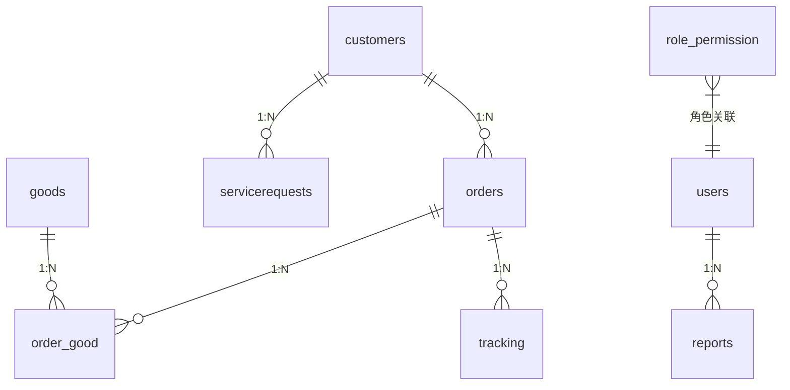

# 物流进销存管理系统设计报告

## 1. 引言
本系统旨在实现物流行业进销存全流程数字化管理，重点解决传统进销存系统在物流场景下的库存动态追踪、多角色权限控制、订单物流状态联动等核心问题。

## 2. 系统架构

### 2.1 整体架构
```plaintext
 +----------------+       +-----------------+
 | 应用逻辑层      | <---> | 数据访问层       |
 | (Spring Boot)  |       | (MyBatis)       |
 +----------------+       +-----------------+
                                  |
                                  v
                          +-----------------+
                          | 数据存储层       |
                          | (MySQL)         |
                          +-----------------+
```


### 2.2 技术栈
| 层级   | 技术选型                    |
|------|-------------------------|
| 后端   | Spring Boot 2.6.13      |
| 安全认证 | JWT + Spring Security   |
| 数据库  | MySQL 8.0               |
| 消息队列 | ~~Apache Kafka~~      |
| 容器化  | Docker + Docker Compose |
| 持续集成 | Github Action           |

## 3. 核心模块设计


### 3.1 用户管理模块
**模块功能**：
- 多级角色体系（超级管理员/仓库管理员/销售员）
- RBAC权限控制模型
- 登录态管理（JWT令牌）

**主要功能点**：
- 用户登录与创建：
   - 支持admin登录后创建其他用户。
   - 实现基于用户名和密码的身份验证（支持多因素认证）。
   - 支持用户名和密码修改。
- 角色管理：
   - 支持角色划分，如一般管理员、仓库管理员、销售管理员。
   - 每个角色拥有特定的访问权限和操作范围。
   - 支持admin修改各个角色的权限。

---

### 3.2 客户管理模块
**模块功能**：
- 实现客户信息的记录、维护与管理。
- 提供客户行为的跟踪与分析功能。
- 支持客户分级和定制化服务，提升客户满意度和粘性。

**主要功能点**：
- 客户信息管理
  - 维护客户的基本信息（如姓名、联系方式、地址等）。
- 客户分级管理
  - 基于客户价值（如消费总额、订单频率等）对客户进行分级。【待开发】


---

### 3.3 货物管理模块
**模块功能**：
- 提供货物信息的录入、和修改功能。
- 支持根据商品的价格、名字进行模糊查询。

**主要功能点**：
- 货物信息录入：
  - 支持货物信息的录入。
  - 支持货物信息的修改。

---
### 3.4 订单管理模块
**模块功能**：
- 提供销售订单的创建、修改和查询功能。
- 自动计算订单金额。
- 与库存管理模块和物流管理模块联动，确保订单执行的完整性。

**主要功能点**：
- 订单创建：
  - 支持手动创建订单。
  - 关联客户信息、商品清单和数量。
- 订单修改与取消：
  - 在订单未出库前允许修改订单详情。
  - 取消订单时释放库存预扣。
- 订单查询与状态跟踪：
  - 支持按时间、客户、商品等条件查询订单。
  - 实时更新订单状态（如“待发货”、“已发货”、“已完成”、“已取消”等）。

---

### 3.5 库存管理模块
**模块功能**：
- 提供商品的入库、出库和库存查询功能。
- 实现库存的动态更新和低库存预警。【待开发】
  
**主要功能点**：
- 入库管理：
  - 支持采购订单完成后的商品入库操作。
  - 自动记录入库时间、数量和操作人员。【待开发】
- 出库管理：
  - 处理销售订单触发的出库请求。【待开发】
  - 更新库存数据并记录出库日志。【待开发】
- 库存查询与预警：
  - 实时查看商品库存数量，支持按仓库、商品分类查询。【待开发】
  - 设置库存阈值，当库存低于阈值时发送预警通知。【待开发】

---

### 3.6 物流管理模块
**模块功能**：
- 跟踪商品的运输状态，为用户提供物流信息查询服务。
- 处理物流异常，支持重新安排运输。【待开发】


**主要功能点**：
- 物流状态更新：
  - 从物流公司 API 接口获取实时物流状态（如“运输中”、“已签收”）。【待开发】
  - 更新订单对应的物流状态。
- 物流信息查询：
  - 根据订单号或物流单号查询商品的运输状态。
- 异常处理：
  - 记录运输延误、货物丢失等异常情况。【待开发】
  - 通知相关用户并协调重新发货。【待开发】

---

### 3.7 报表与分析模块
**模块功能**：
- 提供销售、库存和客户数据的统计分析报表。
- 为业务决策提供支持。
  
**主要功能点**：
- 销售统计：
  - 统计销售额、订单数量、畅销商品等指标。
  - 支持按时间、商品分类、客户分组等维度分析。
- 库存统计：
  - 提供库存变化趋势分析。
  - 生成低库存商品清单。
- 客户分析：
  - 评估客户价值，识别VIP客户。
  - 分析客户购买行为和偏好。


---
### 3.8 服务请求模块
**模块功能**：
- 提供客户服务请求的创建、查询和响应功能。
- 支持客户服务请求的响应和跟踪。

**主要功能点**：
- 服务请求创建：
  - 支持客户服务请求的查询和响应。
- 服务请求响应：
  - 支持处理、记录和更改请求的记录和状态。

---


## 4. 数据库设计


### 4.1 数据表结构说明

#### customers（客户表）
| 字段名       | 数据类型       | 允许空值 | 说明               | 约束               |
|--------------|----------------|----------|--------------------|--------------------|
| CustomerID   | varchar(36)   | 否       | 客户唯一标识       | 主键               |
| Name         | varchar(100)  | 否       | 客户名称           |                    |
| Email        | varchar(100)  | 是       | 客户邮箱           |                    |
| Phone        | varchar(20)   | 是       | 客户电话           |                    |

---

#### goods（商品表）
| 字段名        | 数据类型        | 允许空值 | 说明               | 约束               |
|---------------|-----------------|----------|--------------------|--------------------|
| GoodID        | varchar(36)    | 否       | 商品唯一标识       | 主键               |
| Name          | varchar(36)    | 否       | 商品名称           |                    |
| Description   | text           | 是       | 商品描述           |                    |
| Quantity      | int            | 否       | 库存数量           |                    |
| Price         | decimal(10,2)  | 否       | 商品单价           |                    |

---

#### orders（订单表）
| 字段名          | 数据类型        | 允许空值 | 说明               | 约束               |
|-----------------|-----------------|----------|--------------------|--------------------|
| OrderID         | varchar(36)    | 否       | 订单唯一标识       | 主键               |
| CustomerID      | varchar(36)    | 否       | 关联客户ID         | 外键→customers     |
| OrderDate       | datetime       | 否       | 下单时间           |                    |
| Status          | varchar(20)    | 否       | 订单状态           |                    |
| TotalAmount     | decimal(10,2)  | 否       | 订单总金额         |                    |
| PaymentMethod   | varchar(50)    | 是       | 支付方式           |                    |
| DeliveryMethod  | varchar(50)    | 是       | 配送方式           |                    |
| Remarks         | text           | 是       | 备注               |                    |

---

#### order_good（订单商品关联表）
| 字段名     | 数据类型      | 允许空值 | 说明               | 约束               |
|------------|---------------|----------|--------------------|--------------------|
| OrderID    | varchar(36)  | 否       | 订单ID             | 联合主键，外键→orders |
| GoodID     | varchar(36)  | 否       | 商品ID             | 联合主键，外键→goods |
| Quantity   | int           | 否       | 商品购买数量       |                    |

---

#### servicerequests（服务请求表）
| 字段名       | 数据类型      | 允许空值 | 说明               | 约束               |
|--------------|---------------|----------|--------------------|--------------------|
| RequestID    | varchar(36)  | 否       | 请求唯一标识       | 主键               |
| CustomerID   | varchar(36)  | 否       | 关联客户ID         | 外键→customers     |
| Description  | text          | 否       | 请求描述           |                    |
| Status       | varchar(20)  | 否       | 请求状态           |                    |

---

#### tracking（物流跟踪表）
| 字段名      | 数据类型        | 允许空值 | 说明               | 约束               |
|-------------|-----------------|----------|--------------------|--------------------|
| TrackingID  | varchar(36)    | 否       | 物流跟踪ID         | 主键               |
| OrderID     | varchar(36)    | 否       | 关联订单ID         | 外键→orders        |
| Location    | varchar(255)   | 否       | 当前位置           |                    |
| Timestamp   | datetime       | 否       | 记录时间           |                    |

---

#### users（用户表）
| 字段名      | 数据类型       | 允许空值 | 说明               | 约束               |
|-------------|----------------|----------|--------------------|--------------------|
| UserID      | varchar(36)   | 否       | 用户唯一标识       | 主键               |
| Username    | varchar(50)   | 否       | 用户名             |                    |
| Password    | varchar(255)  | 否       | 密码（加密存储）   |                    |
| Role        | varchar(50)   | 否       | 用户角色           |                    |

---

#### reports（报表表）
| 字段名          | 数据类型      | 允许空值 | 说明               | 约束               |
|-----------------|---------------|----------|--------------------|--------------------|
| ReportID        | varchar(36)  | 否       | 报表唯一标识       | 主键               |
| UserID          | varchar(36)  | 否       | 生成用户ID         | 外键→users         |
| Parameters      | text          | 是       | 报表参数           |                    |
| GeneratedDate   | datetime      | 否       | 生成时间           |                    |
| ReportContent   | text          | 是       | 报表内容           |                    |

---

#### role_permission（角色权限表）
| 字段名         | 数据类型      | 允许空值 | 说明               | 约束               |
|----------------|---------------|----------|--------------------|--------------------|
| RoleID         | varchar(36)  | 否       | 角色ID             | 联合主键           |
| PermissionID   | varchar(36)  | 否       | 权限ID             | 联合主键           |


### 4.2 表关系图


### 4.3 关键约束与索引

- **主键约束**
   - 所有表的主键均为对应业务实体的唯一标识（如 `CustomerID`, `OrderID` 等）。

- **外键约束**
   - `orders.CustomerID` → `customers.CustomerID`
   - `order_good.OrderID` → `orders.OrderID`
   - `order_good.GoodID` → `goods.GoodID`
   - `servicerequests.CustomerID` → `customers.CustomerID`
   - `tracking.OrderID` → `orders.OrderID`
   - `reports.UserID` → `users.UserID`

- **索引**
   - `order_good.GoodID`：加速商品关联查询
   - `orders.CustomerID`：加速客户订单查询
   - `servicerequests.CustomerID`：加速客户服务请求查询
   - `tracking.OrderID`：加速订单物流跟踪查询

### 4.4 示例数据
```sql
-- 客户示例
INSERT INTO customers (CustomerID, Name, Email, Phone) 
VALUES ('CUST001', '张三', 'zhangsan@example.com', '13800138000');

-- 商品示例
INSERT INTO goods (GoodID, Name, Description, Quantity, Price) 
VALUES ('GOOD001', '手机', '高端智能手机', 100, 5999.00);
```


## 5. 接口规范

### 5.1 通用设计原则
- RESTful风格接口
- 版本控制：/api/v1/
- 响应格式标准化：
```json
{
  "code": 200,
  "data": {},
  "message": "success",
  "description": "..."
}
```

### 5.2 核心接口示例
**创建订单**：
```http
POST /orders/add
Content-Type: application/json
AUTHORIZATION: Bearer Token
{
  "customerId": "cust1_ID",
  "items": [
    {"goodId": "g1_ID", "quantity": 2},
    {"goodId": "g2_ID", "quantity": 1}
  ],
  "paymentMethod": "支付宝",
  "deliveryMethod": "快递"
}
```

**响应**：
```json
{
  "code": 200,
  "data": {
    "orderId": "bd67ed79-00f1-488f-bd47-43b2a0e81c86",
    "customerId": "cust1_ID",
    "totalAmount": 22997,
    "status": "PENDING",
    "orderDate": null
  },
  "message": "ok",
  "description": "订单创建成功"
}
```

## 6. 安全设计

### 6.1 认证流程
```sequence
用户->系统: 提交凭证
系统->认证服务: 验证凭证
认证服务-->系统: 签发JWT
系统-->用户: 返回访问令牌
```

### 6.2 权限控制矩阵
具体见文档 [用户角色权限映射](../3.权限管理/用户角色权限映射.md)

